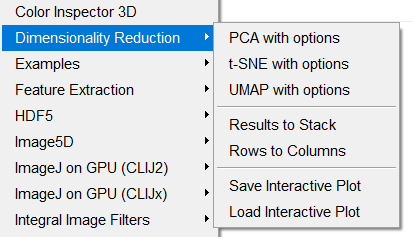
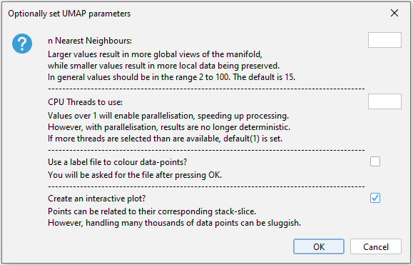
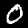
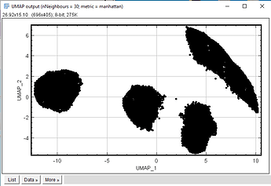
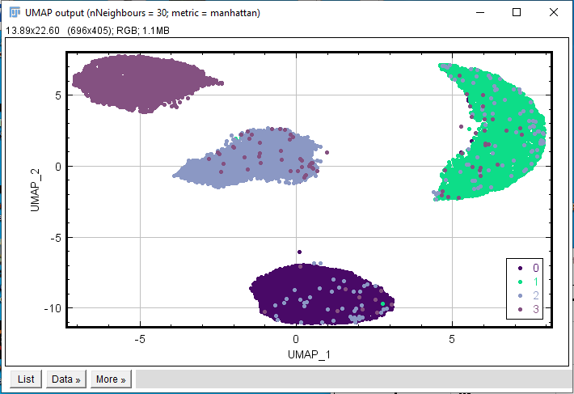
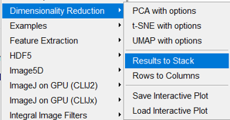
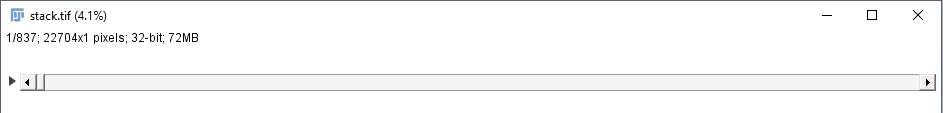
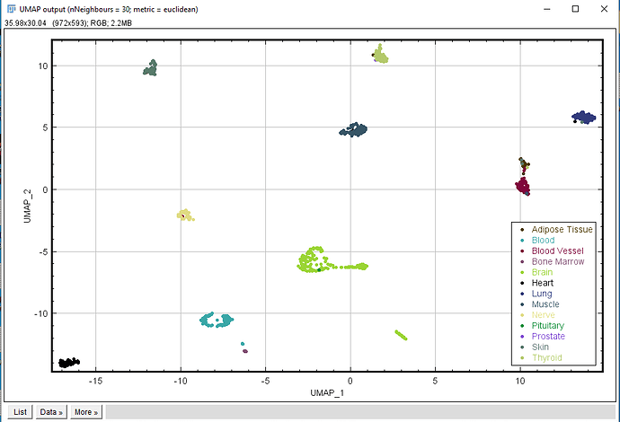
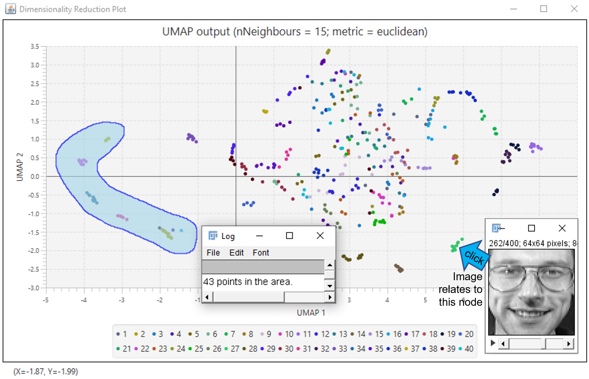

# Dimensionality Reduction (v1.0.4)
*version release date:10/08/22*</br>

This plugin captures data from an open image stack, folder of images, or an open results table and performs one of three dimensionality reduction techniques (PCA, t-SNE, or UMAP) to project the high-dimensional data into a lower dimensional (2D) space that is then plotted onto an ImageJ scatter-plot. Under-the-hood, the plugin uses two really-awesome libraries (t-SNE: Leif Jonsson's [pure Java implementation of Van Der Maaten and Hinton's t-sne clustering algorithm](https://github.com/lejon/T-SNE-Java); and UMAP: Jesse Paquette's (of [tag.bio](https://tag.bio/)) [Java implementation of UMAP](https://github.com/tag-bio/umap-java), based on the reference [Python implementation](https://github.com/lmcinnes/umap)). Both are distributed under open-source licences, so even if this plugin doesn't suit you, perhaps their libraries can find a place in your respective projects!<br/>

The PCA implementation is from Peter Abeles' ([lessthanoptimal](https://github.com/lessthanoptimal)) [efficient java matrix library](https://github.com/lessthanoptimal/ejml). This ImageJ version allows specified principal component axes (e.g. PC-1 vs PC-5) to be plotted and displayed. A specified eigenvector (eigenface) can optionally be reconstructed into an image (NOTE: this option is currently displaying incorrect pixel ranges even if the eigenvectors are true).

From v1.0.3, an interactive scatter plot is output, in addition to the normal ImageJ plot, that allows easy view-toggling of data-clusters and the individual selection of graph points. Clicking on plot points will highlight the corresponding image in an image stack, which is nice for interrogating cluster members and outliers.
v1.0.4 has added a lasso tool to the interactive plot for counting of multiple points within a selection area. In the future, this may be used for sub-level data analysis or labelling. 

An open results table to process can be named anything (it does not need to be the default 'Results' table), but must only contain numeric data. A label may be used to colour datapoints in the final DR plot, but must be selected separate from the table to process.

---
## Using the 'Dimensionality Reduction' plugin on an image stack or folder of images

**NEW: [Youtube tutorial](https://www.youtube.com/watch?v=p90ZYCsKdtw)**

The plugin can be called from a GUI dropdown 'Plugins>Dimensionality Reduction>...'</br>


Which will result in a dialogue box being presented, allowing the user to select some key parameters:</br>
  (UMAP dialogue example)

Or by macro, with the following:

```javascript
run("PCA");
//see the relevant subsection later in this readme for further PCA options

//or

//run t-SNE with default parameters:
run("t-SNE");
//or specifying (example) parameters:
run("t-SNE", "parallel initial_dims=30 perplexity=50 max_iterations=1000");

//or

//run UMAP with default parameters:
run("UMAP");
//or specifying (example) parameters:
run("UMAP", "n_threads=8 n_nearest=20 metric=manhattan");
```

This version does not incorporate all the parameter options offered in the parent libraries, but many of the most important are covered.

**As an example**, running UMAP on a subset (total=24,754) of 'handwritten' mnist numbers (0-3) in an image stack of this kind:</br>
</br>

results in this projection:</br>
 Which nicely represents the 4 groups of numbers!</br>

We can also specify a 'label' file upon calling the plugin, to colour the datapoints by ground-truth (or whatever), with the following macro command:

```javascript
run("UMAP", "label_path=[C:/Users/Antinos/Documents/My_label_file.csv]");
//omitting other specified parameters for clarity in this example
```
With the .csv label file structured as a single column of correctly ordered (with respect to the image stack) labels with a single column-header.

With a label file specified, this plot is produced:</br>


---
## Using the plugin on non-image data
So images are just ordered arrays of data, therefore it makes sense that these dimensionality reduction techniques can be applied to any non-image data just as well as on images. From v1.0.4, the plugin may be run on any open results table that contains only numeric data. Data may also be encoded in an ImageJ image stack before calling the plugin. Data in an open ImageJ table should be presented as column-dimensions and row-samples (e.g. columns = genes, rows = tissue samples). 

For optional image stack encoding, the convenience functions 'Results to Stack' and 'Rows to Columns' are included with the plugin and available in the dropdown menu:</br>


Or by macro:

```javascript
run("Results to Stack");
```
Which pulls ONLY NUMERICAL data from an ImageJ results table to build an N stack of nx1 images, where N is the number of samples (stacks) and n is the number of dimensions. Maybe counter-intuitively, the table-to-encode should be ordered with rows as dimensions and columns as samples.

The convenience feature 'Rows to Columns' transposes data in an open results table.

**As an example of the plugin applied to non-image data**, adding RNA-seq data of 837 single-cells from the GTEx project [GSE45878](https://www.ncbi.nlm.nih.gov/geo/query/acc.cgi?acc=GSE45878) describing the expression of 22704 genes (I may have trimmed the original set a little) you can generate this very odd image stack:</br>


From which you can plot the following (example using UMAP):</br>


---
## PCA specific options

Specify the number of principal components to use. 2 is specified in this example (PC1 + PC2), but it is also the default:

```javascript
run("PCA", "pca_comp=2");
```

Specify which principal component axes to display on the 'PCA output' scatterplot. Principal component 5 and 6 will be displayed using this example: <br/>
(Note: pca_comp will automatically increase to facilitate the request)

```javascript
run("PCA", "pc_x=5 pc_y=6");
```

Specify an eigenvector (eigenface) to recompose and display as an image: <br/>
**(Note: this option is partially working. I believe the eigenvectors are true but the pixel display range is off)**

```javascript
// Display the first eigenvector, corresponding to principal component 1.
run("PCA", "eigen_out=1");
```

Example setting multiple parameters:

```javascript
run("PCA", "pca_comp=10 pc_x=1 pc_y=5 eigen_out=10 label_path=[C:/Users/Antinos/Documents/My_label_file.csv]");
```

---
## The interactive plot

* Use the mouse wheel to zoom in and out.
* Double-click the plot to reset the field-of-view and zoom-level.
* Click on legend icons to toggle data-point visibility on and off.
* Clicking on individual plot points will highlight the corresponding image in the image stack. If you select another stack of images, this will be used by the plugin if it contains the same number of slices. Using this method to select data rows in a processed table is currently not available, but will be added in the future.
* Right-clicking on the graph window will allow the user to copy an image of the plot to the clipboard or to save a fully interactive version of the plot to file.
* Plot save and load functions are also available in the GUI dropdown menu: Plugins>Dimensionality Reduction>...
* Dragging with the left mouse button will allow a freehand lasso selection area to be drawn. Visible datapoints will be automatically enumerated in this area.



Another example, showcasing dimensionality reduction and the interactive plot applied to an image stack of rotation alphabet letters (A to C):
<br><br/>
<br><br/>

<br><br/>

---
## Installation and comments
**Download the plugin from my [googledrive](https://drive.google.com/drive/folders/100w43HWtGFJiPstJmjNOZ-YH9ZFMIy4X?usp=sharing)**. I have also included some test image-stacks and accompanying label.csv files to play with.

**To install the plugin:**
* **copy 'Dimensionality_Reduction-1.0.x.jar' to your Fiji plugins folder.**
* **copy 'javafx.base.jar', 'javafx.swing.jar', javafx.graphics.jar', and 'javafx.controls.jar' to your Fiji jars folder.** (required from v1.0.3.)

*(Technical note: in the future, I may try to Uber-jar the dependency files)*

This plugin will also work well with the 'Cluster My Data' plugin: [link to GitHub repo](https://github.com/antinos/Cluster_My_Data-ImageJ)

Some of the other plugin (macro) parameters I haven't mentioned include:
* t-SNE 'parallel': as you might guess, this runs the plugin in a multi-threaded fashion.
* UMAP 'metric=': allows the user to pick between metrics to measure distance in the input space, including:
    * euclidean (default)
    * manhattan
    * chebyshev
    * minkowski
    * canberra
    * braycurtis
    * cosine
    * correlation
    * haversine
    * hamming
    * jaccard
    * dice
    * russelrao
    * kulsinski
    * rogerstanimoto
    * sokalmichener
    * sokalsneath
    * yule
* 'no_prompt': can be used to suppress the 'process the image stack?' or 'process the open table?' dialogues.

---
Future ideas for extending the functions of the 'Dimensionality Reduction' plugin:
* Allow more than 2 output dimensions
    * Many of the underlying libraries already allow for this, so the ImageJ implementation just needs to be considered and effected
* ~Allow the user to specify an output dimension (e.g. principal component 3/4/5 etc)~ **Has been added in v1.0.2. for PCA**
* ~Allow low dimensional datapoints to be related to their original position/label, on an individual basis~ **Has been added in v1.0.3., but is still a work-in-progress**
    * ~Ideally, this could be achieved in an interactive manner, such that the user could specify points on the 2D output plot that are then correspondingly highlighted in the original matrix/results table/stack of images~
    * ~The existing ImageJ plot may not be compatible with true interactivity, so another graphing solution may need to be found.~